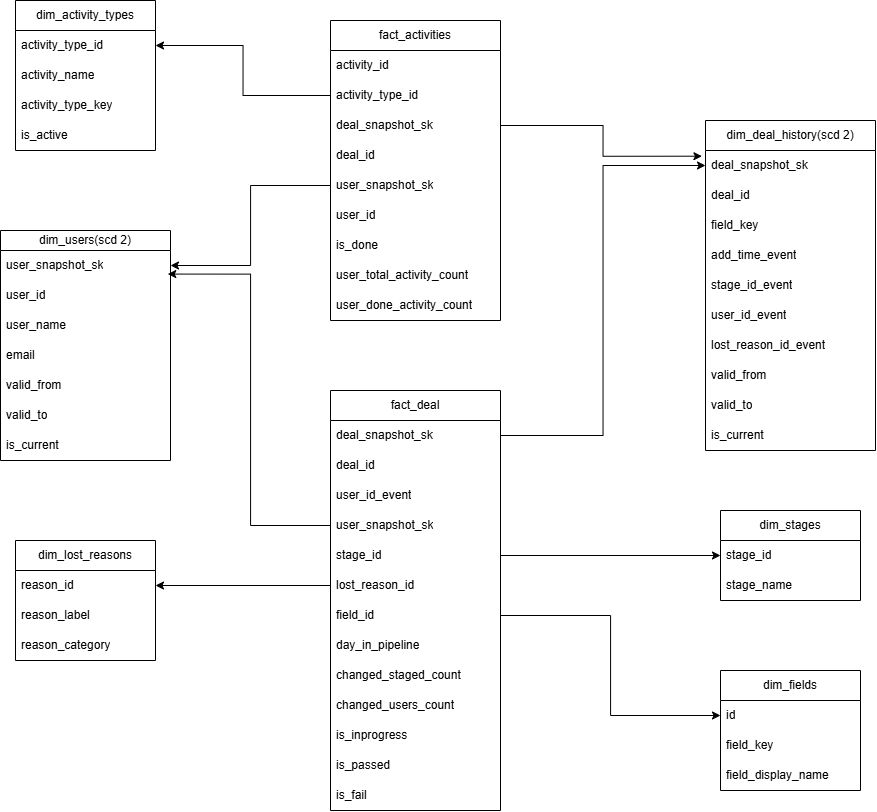

# CRM Data Pipeline and Modeling

This project implements a robust, automated data pipeline that migrates CRM data from local CSV sources to a ClickHouse data warehouse. It utilizes a modern data stack consisting of Airflow for orchestration, ClickHouse for storage, and dbt for data modeling.

## System Architecture
- Orchestration: Apache Airflow (DAGs)
- Transformation: dbt (Data Build Tool)
- Storage: ClickHouse (OLAP)
- Modeling: Star Schema with SCD Type 2 Dimensions

## Setup & Environment
- Docker & Docker Compose
- Python 3.9+
- ClickHouse Server (Running on port 8123/9000)

## Orchestration (Airflow)
### The pipeline is managed by a DAG that executes the following:
- Load: Ingests data into the raw database.
- dbt Run: Executes the Medallion transformation (Staging -> Marts).
- dbt Test: Validates data integrity (null checks, unique keys).

    By default, Airflow uses SQLite, which is a "sequential" database. It locks the entire file whenever it writes data, meaning you can only run one task at a time. If you have 10 dbt models, Airflow will run them one-by-one, wasting your ClickHouse performance. The Solution it to use PostgreSQL as the backend. This enables the LocalExecutor, allowing Airflow to run multiple dbt models in parallel.

## Setup:

Please create .env file on your side based on env.example (just to follow best practice)

Force a clean build without cache to ensure all system dependencies are installed
- docker-compose build --no-cache

Start all services (Airflow, Postgres, ClickHouse) in detached mode
- docker-compose up -d

Reruning init_raw_tables.sql to reset database
- docker compose down  -v

## The Project Structure

```
└───crm-data-pipeline
    │   docker-compose.yml
    │   Readme
    |   .env
    │
    ├───airflow
    │   │   Dockerfile
    │   │   requirements.txt
    │   │
    │   └───dags
    │           crm_ingestion.py
    │
    ├───data
    │       activity.csv
    │       activity_types.csv
    │       deal_changes.csv
    │       fields.csv
    │       stages.csv
    │       users.csv
    │
    ├───dbt_crm
    │   │   .user.yml
    │   │   dbt_project.yml
    │   │   profiles.yml
    │   │
    │   └───models
    │       ├───marts
    │       │       dim_activity_types.sql
    │       │       dim_deal_history.sql
    │       │       dim_fields.sql
    │       │       dim_lost_reasons.sql
    │       │       dim_stages.sql
    │       │       dim_users.sql
    │       │       fact_activities.sql
    │       │       fact_deals.sql
    │       │
    │       └───staging
    │               schema.yml
    │               stg_activities.sql
    │               stg_activity_types.sql
    │               stg_deal_changes.sql
    │               stg_fields.sql
    │               stg_stages.sql
    │               stg_users.sql
    │
    └───scripts
            init_raw_tables.sql
```
## Architecture & Data Flow
The pipeline follows a modern medallion architecture designed for idempotency and performance.
Ingestion (Bronze): An Airflow DAG (crm_ingestion) monitors for new data. It uses a Python-based process to truncate existing raw tables and reload fresh data from CSVs into ClickHouse.
Staging (Silver): dbt models clean and cast the raw string data into appropriate types (e.g., DateTime, Int).
Marts (Gold): Final dbt models apply business logic, including surrogate key generation and         historical state reconstruction (SCD 2).

## Star Schema Data Modeling
The analytics layer is organized into a Star Schema, optimized for fast analytical queries and business reporting.



### 1. Staging Layer
The purpose of this layer is to act as a "clean room." It reads directly from the crm_raw landing zone and performs the heavy lifting of data normalization.


- stg_users:
    - Source: crm_raw.users
    - Purpose: This model cleans the raw layer by standardizing names and emails into a consistent format. It casts IDs to Int64 for high-speed joining and utilizes parseDateTimeBestEffort to handle unpredictable CRM timestamp formats defensively.

- stg_activity_types:
    - Source: crm_raw.activity_types
    - Purpose: This table acts as a "key" that translates technical activity codes into clear words like "Phone Call," "Email," or "Meeting." It fixes messy text and turns "Yes/No" status into simple 1s and 0s so the it can quickly filter out inactive categories.

- stg_activities:
    Source: crm_raw.activity

    Purpose: This model normalizes CRM activity records and converts string-based "True/False" flags into numeric integers. This optimization allows the final "Gold" layer to perform lightning-fast additive calculations (like total tasks completed) rather than expensive string filtering.

- stg_deal_changes:
    - Source: crm_raw.deal_changes
    - Purpose: This model standardizes the CRM’s raw audit trail, ensuring every field change is captured with consistent casing and precise timestamps. It prepares these "delta" records for complex window functions that reconstruct the historical state of any deal at any point in time.

- stg_stages:
    - Source: crm_raw.stages
    - Purpose: This model standardizes the "lookup" data for the sales pipeline. It maps raw numeric Stage IDs to human-readable labels (e.g., "Closed Won" or "Negotiation").

- stg_fields:
    - Source: crm_raw.fields
    - Purpose: Flattens JSON-encoded dropdown options into a relational format. It ensures that complex field metadata is searchable and human-readable.

### 2. Dimension Tables

These tables represent the "Star" in the schema. They are optimized for filtering and grouping in BI tools and include the surrogate keys generated by the cityHash64 logic.

- dim_activity_types:
    - Source: crm_analytics.stg_activity_types
    - Purpose: This table provides a clean list of all possible activity types, turning internal codes into clear names like "First Call".

- dim_users (SCD Type 2):
    - Source: crm_analytics.stg_users
    - Purpose: This table remembers the past. Instead of only showing a user's current name or email, it stores a new row every time their info changes. By using "Start" and "End" dates (valid_from and valid_to), it ensures that every sales activity is linked to exactly how the user's profile looked at that specific moment in time.

- dim_stages:
    - Source: crm_analytics.stg_stages, crm_analytics.stg_fields
    - Purpose: This model creates a master list of stages by combining two different data sources. It uses a COALESCE function to pick the best name available—either from the main stages table or the hidden labels found in the JSON field data

- dim_lost_reasons:
    - Source: crm_analytics.stg_fields
    - Purpose: It is uniquely generated from the JSON field metadata in the fields staging layer, ensuring that even complex, nested CRM settings are turned into simple labels. By linking these reasons to the final reports.

- dim_fields
    - Source: crm_analytics.stg_fields
    - Purpose: This table provides a simplified directory of every attribute in the system (like "Deal created", "Owner", "Stage", or "Lost reason"). Isolating these labels, it ensures that reports always use the correct, human-readable names for data fields, making it easy for anyone to search and filter through audit logs.

- dim_deal_history (SCD Type 2)
    - Source: crm_analytics.stg_deal_changes
    - Purpose: Since the raw data only provides changes (deltas), this table uses ClickHouse window functions (anyLast) to "fill in the blanks" between events. Includes valid_from and valid_to columns. This allows to answer questions like: "What was the value of this deal three weeks ago, before the salesperson changed it?" Combines deal_id and the change_time into a single UInt64 hash (deal_snapshot_sk) to uniquely identify that specific version of the deal.

### 3. Fact tables

- fact_activities:
    - Source: crm_analytics.stg_activities, crm_analytics.dim_users, crm_analytics.dim_deal_history

    - Purpose: This fact table is the heart of reports, acting as a master list for every sales action taken by team. It uses fast numeric IDs to link each activity to the right person, the right deal, and the right activity. Because it is built to work with SCD2  tables, it always shows exactly who was responsible for an action at the moment it happened.
    - The metrics are:
        - user_total_activity_count - total count of activities by user
        - user_done_activity_count - count of done activities by user

    - Foreign keys:
        - deal_snapshot_sk - surrogate key on dim_deal_history (if it is 0, then it is missing in dim_deal_history)
        - user_snapshot_sk - surrogate key on dim_users
        - activity_type_id - key on dim_activity_types

- fact_deals:
    - Source: crm_analytics.dim_fields, crm_analytics.dim_users,  crm_analytics.dim_deal_history, crm_analytics.dim_stages, crm_analytics.dim_lost_reasons

    - Purpose: This table tracks the "health" and "speed" of every sale. It doesn't just show where a deal is today; it calculates how many days it has been open, how many times it changed hands between different salespeople, and whether it ended in a win or a loss. By connecting to SCD 2 tables, it accurately shows which team member was responsible for the deal at every single step of the journey.
    - The metrics are:
        - changed_staged_count - number of changed stages
        - changed_users_count - number of changed users
        - is_inprogress - is the deal in progress(1)
        - is_passed - is the deal passed(1)
        - is_fail - is the deal failed(1)
        - day_in_pipeline - number of days of deal processing

    - Foreign keys:
        deal_snapshot_sk - surrogate key on dim_deal_history
        user_snapshot_sk - surrogate key on dim_users
        field_id - key on dim_fields table
        stage_id - key on dim_stages table
        lost_reason_id - key on dim_lost_reasons table